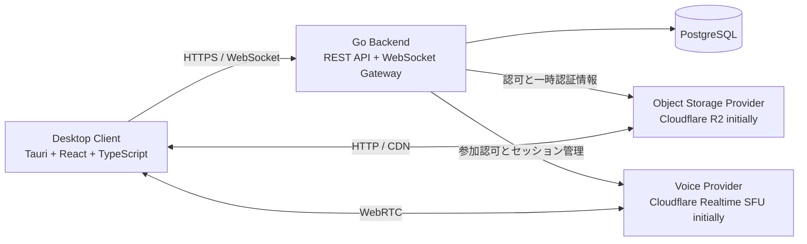

# Aster

Aster は、リアルタイムなチャットと音声通話、セルフホスト可能な運用、柔軟な UI カスタマイズを組み合わせるオープンソースのコミュニケーション基盤です。

> [!IMPORTANT]
> Aster は設計初期段階にあります。
> 現在はTauriデスクトップシェル、Password認証、Guild・Channel・Message API接続を実行できます。安定版APIやGoogle OpenID Connectとの接続は今後の開発対象です。

## 目指すもの

Aster は、次の機能を同じ権限モデルとイベント基盤の上に構築します。

- コミュニティ、テキストチャンネル、ダイレクトメッセージ
- 音声通話、カメラ、画面共有、小規模なライブ配信
- Bot API、Webhook、Application Commands
- デザイントークンを基礎とするテーマとレイアウトの変更
- 公式インスタンスに依存しないセルフホスト

特定の既存サービスをそのまま複製するプロジェクトではありません。
Aster は、リアルタイムな操作感、運用主体を選べる構造、利用者が自分の画面を調整できる設計を一つの基盤にまとめます。

## 設計原則

- バックエンドはモジュラーモノリスから始め、計測結果に基づいて分割する。
- REST API は OpenAPI、Gateway は JSON Schema を正とし、境界の型を手書きで二重管理しない。
- 人間、Bot、Webhook は、可能な限り同じドメインサービスと権限判定を利用する。
- 永続データと、Presence や Typing などの短命な状態を分ける。
- オブジェクトストレージと音声基盤への依存は Provider Interface の内側に置く。
- 添付ファイル、音声、映像のデータを Go バックエンド経由で中継しない。
- 公式ドメインや特定ベンダーを前提とするドメインロジックを作らない。

## システム構成



Go バックエンドは認証、権限、メッセージ、Gateway、音声セッションの制御を担当します。
音声、映像、画面共有のパケットは SFU とクライアントの間を流れ、バックエンドは Control Plane に限定されます。

## 採用予定の技術

| 領域 | 技術 |
| --- | --- |
| デスクトップ | Tauri 2、Rust |
| UI | React、TypeScript、Vite |
| クライアント状態 | TanStack Query、Zustand（第一候補） |
| 境界検証 | Zod |
| バックエンド | Go、WebSocket Gateway |
| データベース | PostgreSQL |
| REST 契約 | OpenAPI |
| Gateway 契約 | JSON Schema |
| 識別子 | UUIDv7（第一候補） |
| オブジェクトストレージ | Cloudflare R2（初期 Provider） |
| 音声と映像 | Cloudflare Realtime SFU（初期 Provider） |

Cloudflare は初期開発の速度と帯域コストを考慮した選択です。
セルフホスト環境で R2、S3、MinIO、別の SFU などへ差し替えられるように、Aster のコア機能から Provider 固有の型と処理を分離します。

## UI プロトタイプを起動する

Node.js 20 以降と npm を用意し、次のコマンドを実行します。

```bash
npm install
npm run dev
```

Tauriデスクトップアプリとして起動する場合は、TauriのOS別依存関係とRustを用意して次を実行します。

```bash
npm run tauri:dev
```

型チェック、本番ビルド、配信用 Worker のテストは次のコマンドで実行できます。

```bash
npm run typecheck
npm test
npm run build
npm run test:sites
npm run tauri:check
```

現在のプロトタイプには、4カラムレイアウト、チャンネルとコミュニティの選択、検索、メッセージ送信、外観設定、表示密度、アクセントカラー、メンバーリスト表示、カラム幅調整、音声通話コントロールの操作状態が含まれます。

Password認証でログインすると、Aster Serverから参加Guild、Guild内Channel、Text ChannelのMessageを取得します。Messageの投稿とCursorによる過去Messageの追加取得にも対応しています。開発時のデモモードでは、Serverなしで従来のサンプルUIを確認できます。Member、Presence、Voiceは対応するProtocolが未定義のため、現時点ではデモ表示です。

### API接続先

REST APIの接続先は`VITE_ASTER_API_URL`で指定します。未指定時は`http://localhost:8080`を使用し、Protocolの`/api/v1`を自動的に付加します。

```bash
VITE_ASTER_API_URL=https://aster.example.com npm run tauri:dev
```

Protocol型を更新する場合は、`Aster-protocol`のマージ済みOpenAPIから生成物を更新します。

```bash
npm run generate:protocol
```

デスクトップ版はAccess Tokenをメモリにだけ保持し、Refresh TokenだけをRust経由でmacOS Keychain、Windows Credential Manager、Linux Secret Serviceへ保存します。ブラウザプレビューではRefresh Tokenを永続化しません。

## UI カスタマイズ

Aster は、テーマを完成後の追加機能として扱いません。
デザイントークンを初期設計に含め、コンポーネントと機能レイアウトがトークンを参照する構造を採用します。

想定する変更対象は、色、背景、フォント、角丸、余白、サイドバー幅、メッセージ密度、プロフィールカード、音声通話画面、コミュニティ単位のテーマ上書きです。

テーマと実行可能なプラグインは別の機能として扱います。
任意の JavaScript 注入は許可せず、Custom CSS を提供する場合も適用範囲と安全性を定義します。

## リポジトリ方針

Aster は、責務とリリース周期が異なる次の3リポジトリで開発します。

| リポジトリ | 責務 |
| --- | --- |
| `Aster` | Tauri、React UI、WebRTC 制御、OS 統合 |
| `Aster-server` | Go API、Gateway、ドメイン機能、DB Migration、Provider 実装 |
| `Aster-protocol` | OpenAPI、Gateway Schema、生成型、Bot SDK、API ドキュメント |

`Aster-protocol` を Protocol Schema の正とし、Client と Server は生成物を利用します。

## 開発ロードマップ

ロードマップは順序を示すものであり、公開時期を保証するものではありません。

1. **Foundation**：リポジトリ構成、CI、Protocol Skeleton、Go Server、Tauri Client、PostgreSQL 接続、認証の土台
2. **Text**：ユーザー、コミュニティ、チャンネル、最小限の権限、メッセージ CRUD、Gateway 再接続、基本 UI
3. **Media**：R2 への直接アップロード、添付ファイル、音声参加、ミュート、画面共有
4. **Platform**：Application、Bot Token、Gateway Intents、Application Commands、Webhook、JavaScript SDK
5. **Customization**：ユーザーテーマ、コミュニティテーマ、レイアウト変更、設定の Import と Export
6. **Public and Self-hosting**：Docker 配布、管理設定、Provider 選択、Moderation、Security Hardening、公開ベータ準備

初期版では、大規模な公開配信、Federation、マイクロサービス化、Kafka、ScyllaDB、Elasticsearch を対象にしません。
これらは、利用規模と計測結果が必要性を示した段階で検討します。

## API と互換性

REST API は `/api/v1` のように URL でバージョンを明示し、一覧取得には Cursor Pagination を優先します。
WebSocket Gateway は Sequence、Heartbeat、Reconnect、Resume、Session、Intents、Backpressure を考慮します。

公開 API と Schema はまだ確定していません。
互換性を保証するリリース段階に入るまでは、事前の告知なく変更される可能性があります。

## セルフホスト

最終的には、運用者が独自ドメイン、PostgreSQL、オブジェクトストレージ、音声 Provider を選んで Aster を構築できる状態を目指します。
開発環境と小規模構成には Docker Compose を提供する予定です。

セルフホスト手順はまだ利用できません。
初期実装が整うまでは、このリポジトリを本番環境へ導入できません。

## コントリビューション

コントリビューション手順、行動規範、開発環境の構築方法は、Foundation Phase で追加します。
実装を始める前に、設計判断を ADR として記録し、API の変更を Protocol Schema から開始できる開発フローを整備します。

ブランチは短期間で完結させ、Pull Request、CI、Review、Squash Merge を経て `main` へ反映する方針です。
Commit Message には Conventional Commits を使用します。

## ライセンス

Aster は [Apache License 2.0](LICENSE) の下で公開されています。

## 商標について

Discord、Misskey、Cloudflare および本文に記載された製品名は、それぞれの権利者に帰属します。
Aster はこれらのサービスや企業から承認、後援、運営を受けるプロジェクトではありません。
